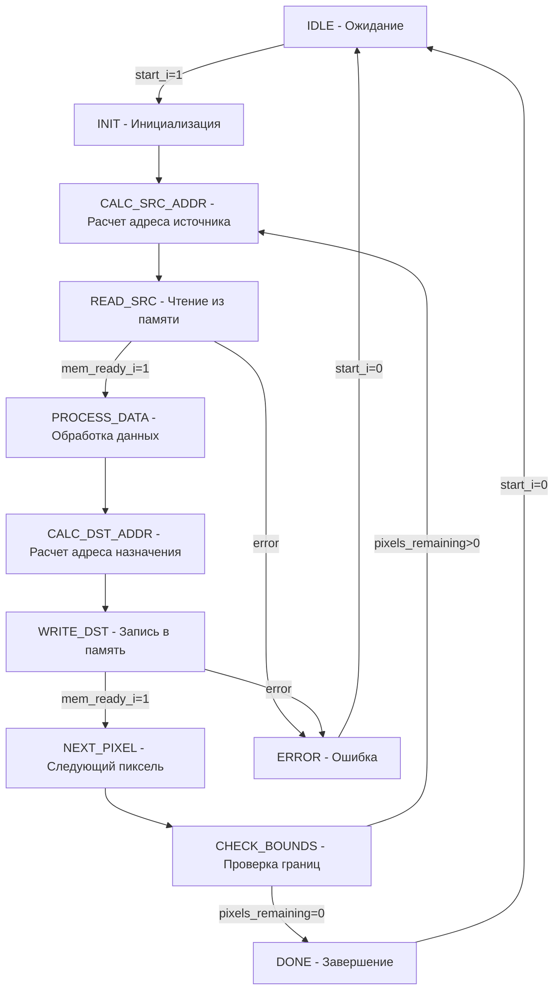

# 📄 Документация на Графический Акселератор для Aleste LX

## 🎯 Обзор Архитектуры

### Блок-Схема Системы

```
┌─────────────────┐    ┌──────────────────┐    ┌─────────────────┐
│   Wishbone      │    │   Регистровый    │    │   Интерфейс    │
│   Slave Interface│◄──►│     Файл        │◄──►│  Прерываний    │
└─────────────────┘    └──────────────────┘    └─────────────────┘
        │                       │                       │
        ▼                       ▼                       ▼
┌─────────────────────────────────────────────────────────────┐
│                Основной Конечный Автомат                    │
│    ┌─────────────┐  ┌─────────────┐  ┌─────────────┐        │
│    │  Вычислитель│  │  Конвертер  │  │  Битный     │        │
│    │   Адресов   │  │  Форматов   │  │  Сдвигатель │        │
│    └─────────────┘  └─────────────┘  └─────────────┘        │
└─────────────────────────────────────────────────────────────┘
        │                       │                       │
        ▼                       ▼                       ▼
┌─────────────────┐    ┌──────────────────┐    ┌─────────────────┐
│  Детектор       │    │  Ограничитель    │    │  Контроллер     │
│  Перекрытий     │    │  Скорости        │    │  Памяти         │
└─────────────────┘    └──────────────────┘    └─────────────────┘
                                                        │
                                                        ▼
                                                ┌─────────────────┐
                                                │   Wishbone      │
                                                │   Master        │
                                                │   Interface     │
                                                └─────────────────┘
```

## 📊 Диаграмма Состояний Основного Автомата



## ⏰ Временная Диаграмма Доступа к Памяти

```
Такты:    0   1   2   3   4   5   6   7   8   9   10
CLK_I:    ▁▁▁▂▂▂▁▁▁▂▂▂▁▁▁▂▂▂▁▁▁▂▂▂▁▁▁▂▂▂▁▁▁▂▂▂▁▁▁▂▂▂▁▁▁▂▂▂
CKE_I:    ▁▁▁▂▂▂▁▁▁▂▂▂▁▁▁▂▂▂▁▁▁▂▂▂▁▁▁▂▂▂▁▁▁▂▂▂▁▁▁▂▂▂▁▁▁▂▂▂

Чтение:
mem_read_req_o: _______________▁▁▁▂▂▂▁▁▁___________________
mem_addr_o:     _________________A1_______________________
mem_ready_i:    _______________________▁▁▁▂▂▂▁▁▁__________
mem_data_i:     _________________________D1_______________

Запись:
mem_write_req_o: ________________________________▁▁▁▂▂▂▁▁▁
mem_addr_o:     _________________________________A2_______
mem_data_o:     _________________________________D2_______
mem_ready_i:    ____________________________________▁▁▁▂▂▂
```

## 🎛️ Регистровая Карта

### Базовые Адреса Регистров

| Адрес | Название | Размер | Описание |
|-------|----------|--------|----------|
| 0x00 | SRC_BASE_ADDR | 32 бита | Базовый адрес источника |
| 0x04 | DST_BASE_ADDR | 32 бита | Базовый адрес назначения |
| 0x08 | SRC_XY | 32 бита | Координаты источника |
| 0x0C | DST_XY | 32 бита | Координаты назначения |
| 0x10 | WIDTH_HEIGHT | 32 бита | Размеры области |
| 0x14 | FILL_COLOR | 32 бита | Цвет заливки |
| 0x18 | TRANS_COLOR | 32 бита | Прозрачный цвет |
| 0x1C | ALPHA_VALUE | 32 бита | Значение альфа-канала |
| 0x20 | BIT_MASK | 32 бита | Битовые маски |
| 0x24 | BIT_SHIFT | 32 бита | Сдвиги битов |
| 0x28 | OP_MODE | 32 бита | Режим операции |
| 0x2C | STATUS | 32 бита | Статус акселератора |
| 0x30 | CONTROL | 32 бита | Управление |

## 🔧 Детальное Описание Регистров

### REG_SRC_XY (0x08)
```
31:16 - SRC_X [15:0] - X-координата источника
15:0  - SRC_Y [15:0] - Y-координата источника
```

### REG_DST_XY (0x0C)
```
31:16 - DST_X [15:0] - X-координата назначения
15:0  - DST_Y [15:0] - Y-координата назначения
```

### REG_WIDTH_HEIGHT (0x10)
```
31:16 - WIDTH [15:0] - Ширина области
15:0  - HEIGHT [15:0] - Высота области
```

### REG_OP_MODE (0x28) - Биты управления
```
Бит 0: AUTO_CLIP - Автоматическое отсечение (1=вкл)
Бит 1: USE_TRANSPARENCY - Использование прозрачности (1=вкл)
Бит 2: ENABLE_ALPHA - Альфа-смешение (1=вкл)
Бит 3: PREFETCH_EN - Prefetch буферизация (1=вкл)
Бит 4: RATE_LIMIT_EN - Ограничение скорости (1=вкл)
Биты 5-6: ADDRESS_MODE - Режим адресации:
          00 = Linear, 01 = Tiled, 10 = Bitmap
Биты 7-8: PIXEL_FORMAT - Формат пикселей:
          00 = 8bpp, 01 = 16bpp, 10 = 32bpp
```

### REG_STATUS (0x2C) - Статусные биты
```
Бит 0: BUSY - Акселератор занят (1=занят)
Бит 1: DONE - Операция завершена (1=завершено)
Бит 2: CORE_ERROR - Ошибка ядра (1=ошибка)
Бит 3: MEM_ERROR - Ошибка памяти (1=ошибка)
Бит 4: BUS_ERROR - Ошибка шины (1=ошибка)
Бит 5: OVERLAP - Обнаружено перекрытие (1=перекрытие)
Бит 6: BUFFER_FULL - Буфер полон (1=полон)
Бит 7: BUFFER_EMPTY - Буфер пуст (1=пуст)
```

### REG_CONTROL (0x30) - Управление
```
Бит 0: START - Запуск операции (1=запуск, автосброс)
Бит 1: RESET - Сброс акселератора (1=сброс)
Бит 2: IRQ_EN - Разрешение прерываний (1=вкл)
Бит 3: IRQ_CLEAR - Сброс прерывания (1=сброс)
```

## 🎨 Форматы Пикселей

### 8bpp (Индексированный цвет)
```
Пиксель = 8 бит (индекс в палитре)
4 пикселя на 32-битное слово
```

### 16bpp (RGB565)
```
Пиксель = 16 бит (5 красный, 6 зеленый, 5 синий)
2 пикселя на 32-битное слово
Формат: RRRRRGGG GGGBBBBB
```

### 32bpp (ARGB8888)
```
Пиксель = 32 бита (8 альфа, 8 красный, 8 зеленый, 8 синий)
1 пиксель на 32-битное слово
Формат: AAAAAAAA RRRRRRRR GGGGGGGG BBBBBBBB
```

## 🔄 Режимы Адресации

### Linear Mode (00)
Линейная адресация по формуле:
```
Адрес = БазовыйАдрес + (Y * Stride + X) * BytesPerPixel
```

### Tiled Mode (01)
Адресация блоками 8x8 пикселей:
```
TileX = X / 8, TileY = Y / 8
InTileX = X % 8, InTileY = Y % 8
Адрес = БазовыйАдрес + (TileY * TileStride + TileX * TileSize + InTileY * 8 + InTileX) * BytesPerPixel
```

### Bitmap Mode (10)
Пакетированная адресация:
```
WordOffset = (Y * Width + X) / PixelsPerWord
SubPixel = (Y * Width + X) % PixelsPerWord
Адрес = БазовыйАдрес + WordOffset * 4
```

## 💾 Программирование Акселератора

### Пример 1: Заполнение области цветом

```c
// Установка параметров
GRAPHIC_ACCEL->SRC_BASE_ADDR = 0; // Не используется для fill
GRAPHIC_ACCEL->DST_BASE_ADDR = framebuffer_addr;
GRAPHIC_ACCEL->DST_X = 100;
GRAPHIC_ACCEL->DST_Y = 50;
GRAPHIC_ACCEL->WIDTH = 200;
GRAPHIC_ACCEL->HEIGHT = 150;
GRAPHIC_ACCEL->FILL_COLOR = 0xFFFF; // Белый цвет (16bpp)

// Настройка режима
GRAPHIC_ACCEL->OP_MODE = 0x01; // Auto-clip enabled

// Запуск операции
GRAPHIC_ACCEL->CONTROL = 0x01; // START bit
```

### Пример 2: Копирование области с прозрачностью

```c
// Установка параметров
GRAPHIC_ACCEL->SRC_BASE_ADDR = src_addr;
GRAPHIC_ACCEL->DST_BASE_ADDR = dst_addr;
GRAPHIC_ACCEL->SRC_X = 10;
GRAPHIC_ACCEL->SRC_Y = 10;
GRAPHIC_ACCEL->DST_X = 100;
GRAPHIC_ACCEL->DST_Y = 100;
GRAPHIC_ACCEL->WIDTH = 64;
GRAPHIC_ACCEL->HEIGHT = 64;
GRAPHIC_ACCEL->TRANS_COLOR = 0x0000; // Черный - прозрачный

// Настройка режима
GRAPHIC_ACCEL->OP_MODE = 0x03; // Auto-clip + Transparency

// Запуск операции
GRAPHIC_ACCEL->CONTROL = 0x01;
```

### Пример 3: Альфа-смешение

```c
// Установка параметров
GRAPHIC_ACCEL->SRC_BASE_ADDR = overlay_addr;
GRAPHIC_ACCEL->DST_BASE_ADDR = framebuffer_addr;
GRAPHIC_ACCEL->SRC_X = 0;
GRAPHIC_ACCEL->SRC_Y = 0;
GRAPHIC_ACCEL->DST_X = 50;
GRAPHIC_ACCEL->DST_Y = 50;
GRAPHIC_ACCEL->WIDTH = 128;
GRAPHIC_ACCEL->HEIGHT = 128;
GRAPHIC_ACCEL->ALPHA_VALUE = 0x80; // 50% прозрачность

// Настройка режима
GRAPHIC_ACCEL->OP_MODE = 0x07; // Auto-clip + Transparency + Alpha

// Запуск операции
GRAPHIC_ACCEL->CONTROL = 0x01;
```

## ⚡ API Функции

### Базовые функции управления

```c
// Инициализация акселератора
void gfx_accel_init(void) {
    GRAPHIC_ACCEL->CONTROL = 0x02; // Reset
    while (GRAPHIC_ACCEL->STATUS & 0x01); // Wait for ready
}

// Запуск операции и ожидание завершения
void gfx_accel_start_and_wait(void) {
    GRAPHIC_ACCEL->CONTROL = 0x01; // Start
    while (GRAPHIC_ACCEL->STATUS & 0x01); // Wait while busy
    if (GRAPHIC_ACCEL->STATUS & 0x04) {
        // Handle error
    }
}

// Проверка статуса
int gfx_accel_is_busy(void) {
    return (GRAPHIC_ACCEL->STATUS & 0x01);
}

// Очистка прерывания
void gfx_accel_clear_irq(void) {
    GRAPHIC_ACCEL->CONTROL = 0x08; // Clear IRQ
}
```

## 🚀 Производительность

### Временные Характеристики

| Операция | Время выполнения (циклов/пиксель) |
|----------|-----------------------------------|
| Fill (заливка) | 2-3 цикла |
| Copy (копирование) | 4-6 циклов |
| Copy with Transparency | 5-7 циклов |
| Alpha Blending | 6-8 циклов |

### Пропускная Способность

При 100 МГц тактовой частоте:
- Fill: ~33-50 Мпикселей/сек
- Copy: ~16-25 Мпикселей/сек
- Alpha Blending: ~12-16 Мпикселей/сек

## 🔍 Отладка и Диагностика

### Регистры для отладки

```c
// Чтение статуса ошибок
uint32_t errors = GRAPHIC_ACCEL->STATUS & 0x1C;

// Проверка перекрытий
if (GRAPHIC_ACCEL->STATUS & 0x20) {
    // Области перекрываются, требуется специальная обработка
}

// Мониторинг буфера
if (GRAPHIC_ACCEL->STATUS & 0x40) {
    // Буфер полон - возможны задержки
}
```

### Обработка ошибок

```c
void gfx_accel_error_handler(void) {
    uint32_t status = GRAPHIC_ACCEL->STATUS;
    
    if (status & 0x04) printf("Core error detected\n");
    if (status & 0x08) printf("Memory error detected\n");
    if (status & 0x10) printf("Bus error detected\n");
    
    // Сброс акселератора при ошибке
    GRAPHIC_ACCEL->CONTROL = 0x02;
}
```

## 📋 Таблица Прерываний

| Бит | Событие | Описание |
|-----|---------|----------|
| 0 | OPERATION_DONE | Операция завершена |
| 1 | CORE_ERROR | Ошибка в ядре акселератора |
| 2 | MEM_ERROR | Ошибка доступа к памяти |
| 3 | BUS_ERROR | Ошибка шины Wishbone |

## 🎯 Оптимизация Производительности

### Использование Prefetch

```c
// Включение prefetch буферизации
GRAPHIC_ACCEL->OP_MODE |= 0x08;

// Настройка размера буфера
// (реализация зависит от конкретной версии акселератора)
```

### Ограничение скорости для энергосбережения

```c
// Установка ограничения скорости
GRAPHIC_ACCEL->OP_MODE |= 0x10; // Rate limit enable
// Дополнительные биты для настройки уровня ограничения
```

## 🔧 Советы по Использованию

1. **Всегда проверяйте статус BUSY** перед началом новой операции
2. **Используйте AUTO_CLIP** для автоматического отсечения выходящих за границы операций
3. **Включайте Prefetch** для линейных операций для увеличения производительности
4. **Проверяйте наличие перекрытий** при копировании внутри одного буфера
5. **Используйте ограничение скорости** при работе от батареи

Данная документация покрывает все аспекты программирования и использования графического акселератора для Aleste LX.