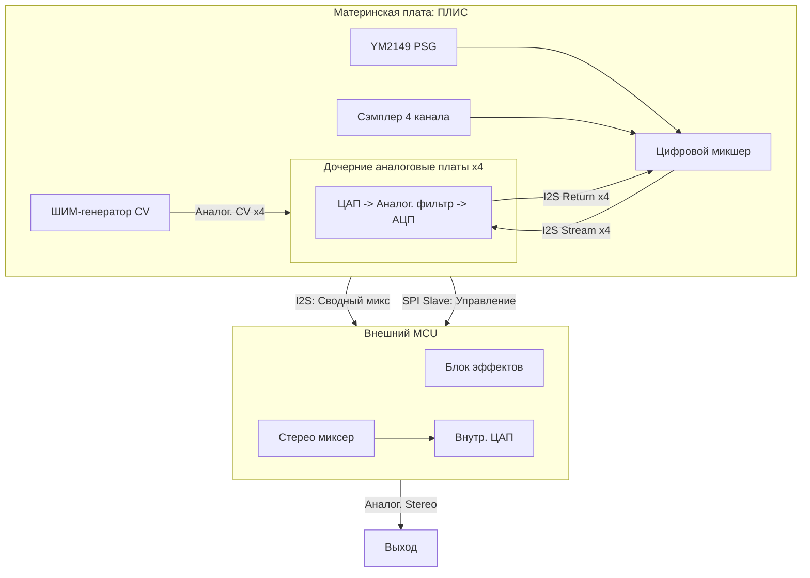

# Архитектура Звуковой Подсистемы LX: Окончательный Дизайн

1. Философия и Цели (KISS & Modularity)
*   Базовая плата: Максимально простая, дешёвая и функциональная «из коробки».
*   Расширение: Полная свобода для создания нишевых аналоговых модулей через продуманные коннекторы.
*   Разделение ответственности: ПЛИС — генерация данных, MCU — обработка и эффекты, аналоговые платы — фильтрация.

2. Блок-Схема и Взаимодействие Компонентов



3. Детальное Описание Работы

3.1. ПЛИС (FPGA) — Цифровое Ядро
*   Источники звука:
    *   Сэмплерный синтезатор: 4 независимых монофонических канала.
    *   YM2149 (PSG): 3 канала, программно назначаемые на любую из 4-х шин микшера.
*   Цифровой Микшер: Сводит каналы сэмплера и PSG в 4 независимых моно I2S-потока.
*   ШИМ-Генератор: Создаёт аналоговые управляющие напряжения (CV) путём фильтрации ШИМ-сигналов через RC-цепи. Предназначены для управления параметрами аналоговых фильтров на дочерних платах (частота среза, резонанс).
*   Интерфейсы:
    *   I2S x4: Передача цифрового аудио на дочерние платы и приём обработанного сигнала назад.
    *   I2S (Master): Отправка сводного цифрового микса (4 канала) на MCU для обработки.
    *   SPI (Slave): Предоставляет MCU доступ к управляющим регистрам (громкость, панорама для каждого канала, статус).

3.2. Дочерние Аналоговые Платы (Опционально)
*   Назначение: Аналоговая обработка голосов (фильтрация, огибающая).
*   Архитектура платы: Каждая плата представляет собой автономный голос.
    *   ЦАП: Преобразует входящий I2S-поток в аналог.
    *   Аналоговый фильтр/ВЦА: Обрабатывает звук под управлением CV-сигналов с материнской платы.
    *   АЦП: Оцифровывает обработанный аналоговый сигнал и отправляет его обратно в ПЛИС.
*   Вариант для энтузиастов: Вместо использования аналоговых CV с ШИМ, плата может получить с коннектора SPI и использовать свой собственный точный ЦАП для управления.

3.3. Внешний Микроконтроллер (MCU) — Финальная обработка
*   Приём данных: Получает от ПЛИС по I2S сводный микс из 4-х каналов.
*   Получение параметров: По SPI читает из ПЛИС актуальные значения панорамы и громкости для каждого канала.
*   Обработка (DSP):
    *   Применяет к каждому каналу индивидуальную панораму и уровень.
    *   Накладывает эффекты: реверберация, стерео-задержка, хорус, фленджер.
*   Финальный вывод: Сводит всё в стерео-сигнал и выводит через свой встроенный или внешний ЦАП на линейный выход.

4. Сценарии Использования

*   Базовый (Без дочерних плат): Звук с ПЛИС (сэмплер + PSG) сразу идёт на MCU, где обрабатывается и превращается в качественный стерео-сигнал с эффектами. Просто и мощно.
*   Продвинутый (С аналоговыми платами): Каждый голос вначале проходит через аналоговый тракт (фильтр), оцифровывается и возвращается, а затем MCU применяет к уже обработанным голосам финальные эффекты (реверберацию) и стереопанораму. Максимальная аутентичность и гибкость.

5. Заключение

Данная архитектура предоставляет исчерпывающий баланс между простотой и мощностью. Она решает все поставленные задачи:
1.  Сохраняет наследие (YM2149).
2.  Предоставляет современный 4-канальный сэмплер.
3.  Обеспечивает простую работу «из коробки» с богатым звуком.
4.  Открывает неограниченные возможности для расширения через аналоговые модули.
5.  Реализует профессиональные стерео-эффекты через кооперацию ПЛИС и MCU.

Фокус на текущем этапе: реализация цифрового микшера в ПЛИС и прототипирование firmware для MCU.

6. Структура файлов устройства

```
magic_sound_2/
├── rtl/                      // Основная директория с исходным кодом
│   ├── magic_sound_2.sv     // Top-level модуль (обвязка, инстансы всех блоков)
│   ├── ms2_wb_slave.sv      // Интерфейс Wishbone Slave (работа с регистрами с Z80)
│   ├── ms2_wb_master.sv     // Интерфейс Wishbone Master (арбитраж, чтение из памяти)
│   ├── ms2_channel.sv       // Модуль одного канала (аккумулятор, управление loop)
│   ├── ms2_mixer.sv         // Модуль интерполяции и микширования
│   ├── ms2_i2s_tx.sv        // Модуль передачи данных по I2S
│   ├── ms2_timer.sv         // Модуль музыкального таймера и прерываний
│   └── pkg_ms2.sv           // Пакет с общими константами, типами, структурами
├── tb/                      // Директория для тестового окружения (testbench)
│   └── tb_magic_sound_2.sv  // Главный testbench
└── syn/                     // Директория для скриптов синтеза (если нужно)

```